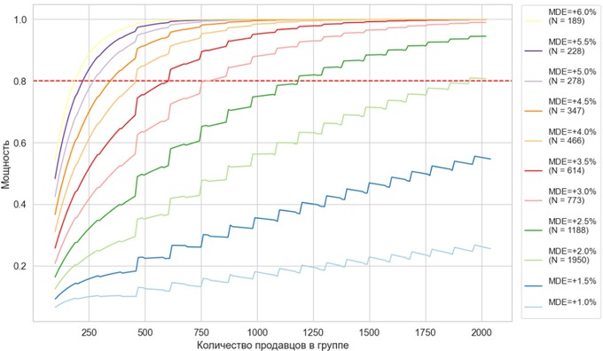

<h1>A/B-контест от samokat.tech</h1>

Одна из проблем при привлечении продавцов на площадку — это регистрация неблагонадежных продавцов-мошенников.

Распространённая и самая известная на рынке схема мошенничества:
  мошенник берёт данные ИНН из открытых источников, регистрирует на него компанию на площадке маркетплейса.
  Далее выставляет ходовой товар на продажу, например iPhone 14, на 50% дешевле рынка.
  Когда покупатель оформляет заказ на маркетплейсе, продавец пишет покупателю, что у него есть другой сайт,
  где можно купить товар ещё дешевле. Покупатель соглашается и оплачивает заказ по ссылке продавца в обход площадки.
  После этого продавец пропадает. Покупатель остается без товара.
  Такие продавцы очень сильно портят репутацию маркетплейса, и необходимо их выявлять как можно быстрее,
  лучше всего в процессе регистрации.

Для этого ML-команда предложила к использованию модель по автоопределению продавцов-мошенников,
  которую нам предлагается внедрить в процесс регистрации продавца.

Мы хотим ввести новый функционал,
  но как data-driven компания не можем это сделать без тестирования и
  проверки качества новой функциональности через A/B-тест.

<h2>Задание</h2>
<h3>Ответить на вопросы</h3>
<ul>
  <li>Как определить, какой продавец мошенник, а какой — нет? Какие ещё могут быть схемы мошенничества?</li>
  <li>Какие продуктовые фичи могут помочь нашим клиентам избежать неприятных ситуаций с мошенничеством?</li>
  <li>Через какую механику мошенник узнает контакты покупателя? Что можем сделать, чтобы усложнить жизнь фродерам?</li>
</ul>
<h3>Описать методологию и дизайн A/B-теста</h3>
<ul>
  <li>Определить основную метрику (дополнительные метрики) и принцип разделения на группы.</li>
  <li>Рассчитать, какой эффект можно статистически значимо отследить.</li>
</ul>

<h2>Результаты расчетов</h2>
<h3>Распределение мощности от количества продавцов при различном MDE</h3>

Среднее количество регистраций в неделю в контрольной группе = 330,5 ± 39,9 (±2σ).

Среднее количество регистраций в неделю в тестовой группе = 327,1 ± 36,5 (±2σ).

Рассмотрим худший случай, когда у нас будет минимальное количество регистраций каждую неделю: тестовая - 2σ = 290 регистраций.

<ul>
  <li>MDE = 10.1% (+2.0), длительность A/B-теста: 6.7 недель</li>
  <li>MDE = 10.6% (+2.5), длительность A/B-теста: 4.1 недель</li>
  <li>MDE = 11.1% (+3.0), длительность A/B-теста: 2.7 недель</li>
  <li>MDE = 11.6% (+3.5), длительность A/B-теста: 2.1 недель</li>
  <li>MDE = 12.1% (+4.0), длительность A/B-теста: 1.6 недель</li>
  <li>MDE = 12.6% (+4.5), длительность A/B-теста: 1.2 недель</li>
  <li>MDE = 13.1% (+5.0), длительность A/B-теста: 1.0 недель</li>
</ul>

<h2>Результаты дизайна A/B-теста</h2>

Оптимальные сроки проведения эксперимента: 2-4 недели. Такая длительность позволит зафиксировать долю мошенников в тестовой группе равную 10,6-11,6% (+2,5-3,5%), изначально доля равна 8,1%.

Для фиксации доли мошенников в тестовой группе в 10,1% (+2%) потребуется значительное увеличение сроков эксперимента – около 7 недель.

